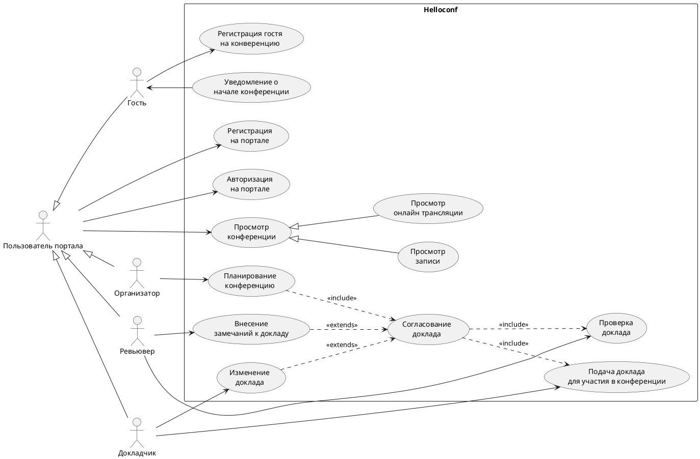

# Описание требований и архитектуры

## Введение
<!-- Общее краткое описание создаваемой системы -->
Описывается архитектурное решение по созданию портала проведения научно технических конференций.

Задача решается в рамках практической части курса Школы Архитекторов МТС.

- [Описание требований и архитектуры](#описание-требований-и-архитектуры)
  - [Введение](#введение)
  - [Заинтересованные стороны](#заинтересованные-стороны)
  - [Бизнес-контекст (бизнес-требования)](#бизнес-контекст-бизнес-требования)
  - [Глоссарий](#глоссарий)
  - [Модель предметной области](#модель-предметной-области)
  - [Требования к системе](#требования-к-системе)
    - [Сценарии использования (Use case)](#сценарии-использования-use-case)
    - [Функциональные требования](#функциональные-требования)
    - [Нефункциональные требования/Требования к атрибутам качества](#нефункциональные-требованиятребования-к-атрибутам-качества)
    - [Ограничения](#ограничения)
  - [Архитектура](#архитектура)
    - [Журнал архитектурных решений](#журнал-архитектурных-решений)
    - [Контекст решения](#контекст-решения)
    - [Компонентная архитектура](#компонентная-архитектура)
    - [Реализация сценариев использования](#реализация-сценариев-использования)
    - [Программные интерфейсы](#программные-интерфейсы)
    - [Схема развертывания](#схема-развертывания)
  
## Заинтересованные стороны
<!-- Перечень заинтересованных сторон и их интересов по отношению к создаваемой системе. 
Подробнее: https://confluence.mts.ru/pages/viewpage.action?pageId=399975538 
-->
| Заинтересованная сторона             | Интересы                                                                                                                      |
| :----------------------------------- | :---------------------------------------------------------------------------------------------------------------------------- |
| Менеджер проекта                     | Берёт обязательства по организации производственного процесса по созданию решения                                             |
| Команда разработки                   | Учавствует в проработе и реализации решения                                                                                   |
| HR департамент                       | Планируют ханитить высококвалифицированных специалистов во время проведения конференций                                       |
| Отдел маркетинга                     | Будут продвикать на партнёрских информационных ресурсах информацию о проводимых конференциях                                  |
| Организаторы конференций             | Отвечают за организацю конференций (отбор докладчиков, составление расписания и т.д. ).                                       |
| Докладчики                           | Автор доклада желающий выступить на конференции                                                                               |
| Гости                                | Слушатели докладов в оффлайн и онлайн форматах                                                                                |
| Куратор проекта от совета директоров | Заказчик и инвестор системы                                                                                                   |
| Департамент инфраструктуры           | Выделяют инфраструктуру для функционирования системы                                                                          |
| Юридический департамент              | Консультируют оргпнизаторов по правовым вопросам (интелектуальная собственность, требования по проведению офлайн конференций) |

## Бизнес-контекст (бизнес-требования)
<!-- Общее описание бизнес-контекста создаваемой системы (автоматизируемой деятельности), список бизнес-целей заинтересованных сторон 
Подробнее: https://confluence.mts.ru/pages/viewpage.action?pageId=399973845
-->
- Для популяризации бренда компании в сфере инновационных и информационных технологиях необходимо создать площадку для проведения научно технических конференций
- Необходимо гарантировать проверку качества планируемого доклада
- Необходимо организовать сбор обратной связи для улучшения проведения НТК в будущем
- Для охвата наибольшего кол-ва людей, необходимо дать возможность смотреть доклады конференции всем желающим в не зависимости от места проведения самой конференции.
- Доклады должны проводиться как в офлайн так и онлайн режимах

## Глоссарий
<!-- Содержит основные понятия и термины предметной области  
Подробнее: https://confluence.mts.ru/pages/viewpage.action?pageId=375782595
-->
| Понятие                        | Сокращение | Определение                                                                                                              |
| :----------------------------- | :--------- | :----------------------------------------------------------------------------------------------------------------------- |
| Научно техническая конференция | НТК        | Основное мероприятие организация и проведение которого осуществляется на создаваемом портале                             |
| Портал для проведения НТК      | Портал     | Информационная система разрабатываемя в рамках данного решения. Предназначена для решения поставленных Бизнес-требований |
| Докладчик                      | -          | Участник НТК, выступающий с докладм                                                                                      |
| Организатор                    | -          | Основное мероприятие организация и проведение которого осуществляется на создаваемом портале                             |
| Ревьювер доклада               | Ревьювер   | Эксперт в предметной области. Привлекается для оценки качества планирумемого доклада                                     |
| Гость НТК / Слушатель          | Гость      | Участник НТК, слушающий доклады                                                                                          |

## [Модель предметной области](data/data.md)

## Требования к системе

### Сценарии использования (Use case)
<!-- Подробное описание сценариев использования системы с привязкой к ролям участников и задействованным бизнес-сущностям 
https://confluence.mts.ru/pages/viewpage.action?pageId=375782108 
https://confluence.mts.ru/pages/viewpage.action?pageId=375782119 
-->
#### Диаграмма сценариев использования (Use Case Diagram) <!-- omit in toc -->

#### Список сценариев использования <!-- omit in toc -->

| ID     | Описание                                          |
| ------ | ------------------------------------------------- |
| UC.001 | *[Название сценария использования](uc/uc.001.md)* |

### Функциональные требования
<!-- Описание требований к функциям, реализуемым системой. Требование может быть привязано к сценарию использования или быть общим 
Подробнее: https://confluence.mts.ru/pages/viewpage.action?pageId=375782501 
-->
| ID     | Функциональное требование                                                                                          |
| ------ | ------------------------------------------------------------------------------------------------------------------ |
| FR.001 | Пользователь должен иметь возможность зарегистрироваться на потали при помощи логина и пароля                      |
| FR.001 | Система должна различать пользователей по ролям. Какой функционал доступен для пользователя зависит от его роли    |
| FR.001 | Пользователь с ролью Гость должен иметь возможность записаться на конференцию как слушатель                        |
| FR.001 | Пользователь с ролью Гость должен иметь возможность настроить напоминание о начале конференции                     |
| FR.001 | Пользователь с ролью Гость должен иметь возможность оставить комментарий к просмотреному докладу                   |
| FR.001 | Пользователь с ролью Докладчик должен иметь возможность подать доклад для участия в конференции                    |
| FR.001 | Пользователь с ролью Докладчик должен иметь возможность видеть статус рассмотрения его доклада                     |
| FR.001 | Пользователь с ролью Ревьювер должен иметь возможность оставить комментарий к докладу                              |
| FR.001 | Пользователь с ролью Ревьювер должен иметь возможность разрешить или отклонить доклад для конференции              |
| FR.001 | Пользователь с ролью Организатор должен иметь возможность управлять расписанием конференции                        |
| FR.001 | Система должна предоставлять возможноть пользователя просматривать конференции в режиме онлайн трансляции и записи |

### Нефункциональные требования/Требования к атрибутам качества
<!-- Требования к основным архитектурным характеристикам (атрибутам качества) системы - надежность, масштабируемость, ИБ, и др.
Подробнее: https://confluence.mts.ru/pages/viewpage.action?pageId=375782530
-->
| ID     | Атрибут качества            | Описание требования                                                                                 |
| ------ | --------------------------- | --------------------------------------------------------------------------------------------------- |
| QR.001 | Производительность          | Система должна позволять смотреть трансляцию 2000 гостям без подвисаний                             |
| QR.001 | Производительность          | Система должна позволять обрабатывать 500 заявок на доклад в рамках одной конференции               |
| QR.001 | Информационная безопасность | При взаимодействии с сервером. должен использоваться протокол HTTPS                                 |
| QR.001 | Информационная безопасность | Пароли пользователей не должны хранитьяс на сервере в явном виде                                    |
| QR.001 | Надежность                  | Натификаци о начале конференции должна успешно доставляться 90 % зарегистрированым пользователям    |
| QR.001 | Надежность                  | В случае отказа БД, должны быть востановленны данные хранившиеся минимум 5 часов                    |
| QR.001 | Требования к интеграции     | Необходимо реализовать интеграцию с сервисом нотификаций и стриминга                                |
| QR.001 | Наблюдаемости               | Запросы поступаемые с клиентской части на сервер должны логироваться и храниться в течении 1 месяца |

### Ограничения
<!-- Описываются ограничения, оказывающие влияние на архитектуру системы - временные, финансовые, технологические
Подробнее: https://confluence.mts.ru/pages/viewpage.action?pageId=375782592
-->
| ID     | Ограничение                                                                        |
| ------ | ---------------------------------------------------------------------------------- |
| AC.001 | К участию в конференции допускаются только прошедшие ревью доклады                 |
| AC.001 | Доклад принимается в форматах pdf, pptx                                            |
| AC.001 | Фронтальная часть решения должна реализовываться по принцыпу SPA с применение AJAX |
| AC.001 | Для бэкенд части необходимо использовать Java Spring                               |
| AC.001 | В качестве СУБО использовать PostgreSQL                                            |
| AC.001 | Для работы с логами использовать ELK стек                                          |

## Архитектура

### Журнал архитектурных решений
<!-- Записи о ключевых принятых архитектурных решениях (ADR) для реализации архитектурно-значимых требований.
Подробнее: https://confluence.mts.ru/pages/viewpage.action?pageId=421162308
-->
- [ADR.NNN Суть решения](adr/adr-template.md)

### [Контекст решения](context/context.md)

### [Компонентная архитектура](components/components.md)

### Реализация сценариев использования
<!-- Реализация сценариев использования на основе взаимодействия компонентов системы и внешних систем/участников.
Диаграммы последовательности (UML Sequence diagram) и текстовое описание.

Подробнее: 
https://confluence.mts.ru/pages/viewpage.action?pageId=399442132
https://confluence.mts.ru/pages/viewpage.action?pageId=399442170
-->
| ID     | Описание                          | Реализация                                    |
| ------ | --------------------------------- | --------------------------------------------- |
| UC.001 | *Название сценария использования* | [Реализация сценария](uc-impl/uc.001-impl.md) |

### Программные интерфейсы
<!-- Спецификации публичных API системы и ее компонентов (синхронных, событийных). Создается на основе модели предметной области для реализации сценариев использования. 
  Форматы: OAS/Swagger, GraphQL, AsyncAPI/CloudEvents
-->
| Компонент             | Интерфейс                                      |
| :-------------------- | :--------------------------------------------- |
| *Название компонента* | *[Название интерфейса](api/service-name.yaml)* |

### [Схема развертывания](deployment/deployment.md)
